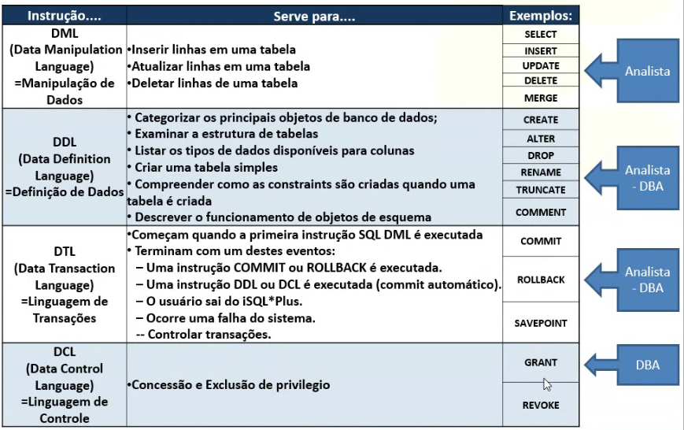

## SQL

### Normalização de dados

##### 1ª Forma Normal (1FN)
Consiste em garantir que todas as entidades estejam com cmapos atômicos, ou seja, sem serem multivalorados.

Por exemplo, endereço estar bem dividido, ou caso exista mais de um telefone garantir que cada um terá sua coluna.

##### 2ª Forma Normal (2FN)
Consiste em garantir que todos os atributos não chave sejam dependes do atributo chave. Se necessário dividir em 2 ou mais tabelas.

##### 3ª Forma Normal (3FN)
Nessa Forma Normal deve-se excluir colunas que podem ser obtidas por meio de operações entre outras colunas.

Por exemplo, caso tenhamos uma coluna de "valor unitário" e outra de "quantidade", não precisamos ter uma com "valor total", pois podemos obter a mesma multiplicando as duas anteriores.

##### Outras Formas Normais
Existem ao todo 5 Formas Normais, porém o uso da 4FN e 5 FN são bem incomuns e por isso a base de dados já é considerada normalizada ao chegar na 3FN.

### Comandos SQL
Abaixo temos um quadro com os principais comando quando trabalhamos com SQL:

#### DCL - Data Control Language
Aqui temos um subgrupo para aspectos de autorização de acesso aos dados e licenças de usuários.

- __GRANT__: Autoriza o usuário a executar operações no banco.
Ex: GRANT SELECT ON tabela TO pessoa;
- __REVOKE__: Tira as permissões cedidas do usuário.
Ex: REVOKE CREATE TABLE FROM pessoa;

#### DTL - Data Transaction Language
Subgrupo que serve para controle de versionamento e afins.

- __BEGIN__: Inicia a transação
- __COMMIT__: Finaliza a transação
- __BEGIN__: Desfaz alterações depois do último COMMIT.

#### DDL - Data Definition Language
Subgrupo que cria, altera e exclui banco de dados, tabelas e itens de índice.

- __CREATE__: Utilizado para criação de bancos, tabelas, etc
Ex: CREATE DATABASE banco;
- __ALTER__:Faz a alteração em tabelas
Ex: ALTER TABLE cliente ADD telefone VARCHAR(14);
- __DROP__: Serve para deletar bancos e tabelas
Ex: DROP TABLE cliente;

#### DML - Data Manipulation Language
Subgrupo de insersão, alteração e deleção de registros na tabela.

- __INSERT__: Serve para adicionar registro em uma tabela.
Ex: INSERT INTO cliente(nome, telefone) VALUES ('José', '1234-5678')
- __UPDATE__: Altera um registro na tabela com base na chave primária.
Ex: UPDATE cliente SET nome='Maria' WHERE idcliente = 1;
- __DELETE__: Exclui um registro na tabela com base na chave primária.
DELETE FROM cliente WHERE idcliente = 1;