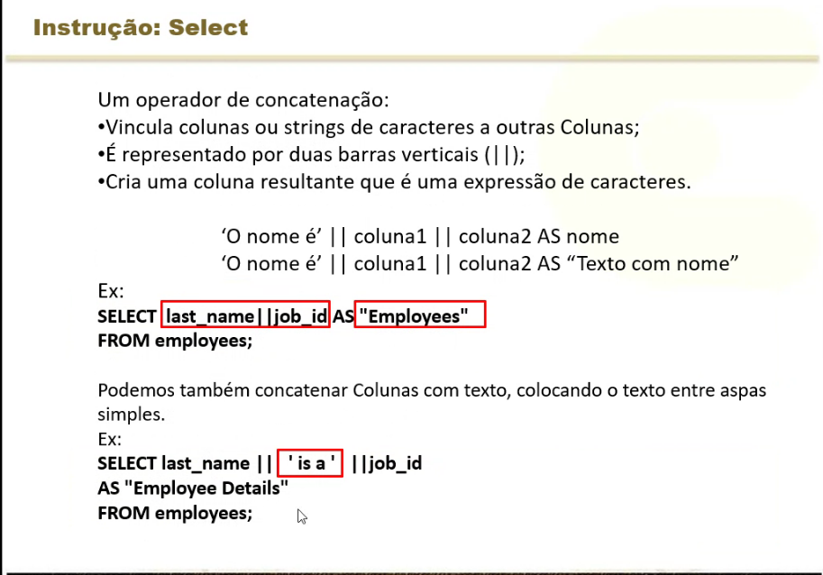
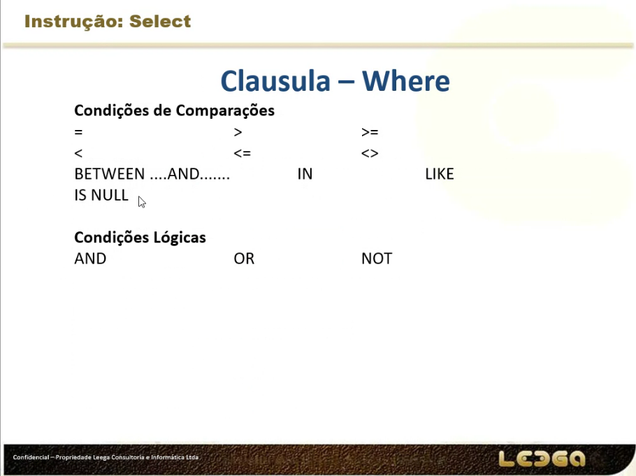
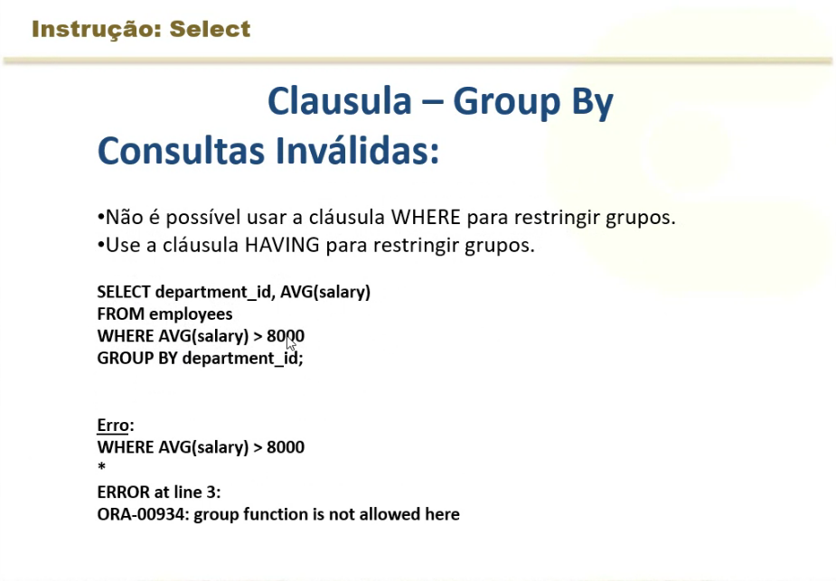
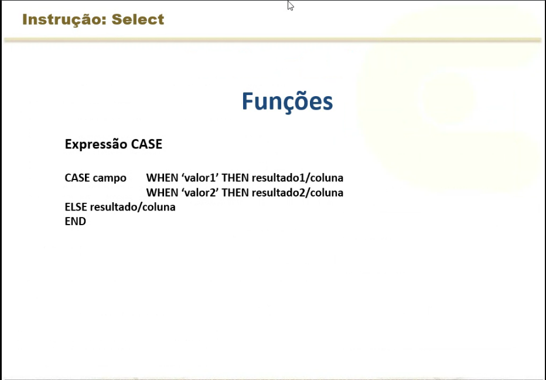

## SQL - Dia 1

Projeção - É escolher as colunas.
Seleção - É a escolha de linhas.
Join - A união de dados em tabeals diferentes.

- Comandos

- Juntando colunas

- Clasulas Where

- No caso abaixo o certo seria usar o Having

- Case é util quando queremos ja converter valores para outro tipo.

Por exemplo, digamos que tem sexo 1 e 2, mas o 1 é masculino e o 2 feminito.

Podemos fazer:

Select nome, CASE sexo WHEN '1' THAN 'm'
ELSE 'f'
END